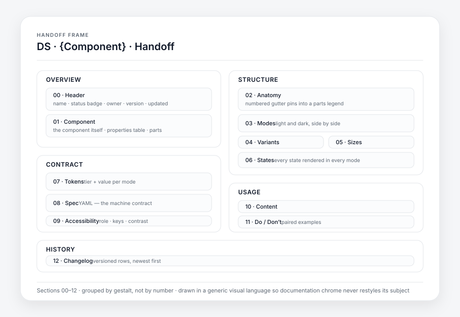

# Figma Specsheet

> A Claude skill that **builds and audits the spec sheet for a design system component,
> inside Figma** — anatomy, modes, states, tokens, accessibility and do/don't — drawn on the
> canvas for designers and emitted as a machine-readable spec block for developers.

Spec sheets rot. They get written once, the component changes, and nobody notices. This
skill treats the sheet as a **build artifact**: it can create one from scratch, audit an
existing one against a 128-check rubric, or re-audit after a designer edits the component and
lead with what changed.



<sub>The frame as generated: thirteen numbered sections, grouped so related ones read as
one block. Drop a real render at `docs/handoff-frame.png` and add it here once you've run
the skill on a component of your own.</sub>

---

## What it produces

A single **handoff frame** on the canvas — thirteen numbered sections in five chapter
groups, with the component master itself living inside it so the two cannot drift apart:

| Group | Section | Contents |
|---|---|---|
| Overview | `00 · Header` | Name, status badge, owner (from your Figma account), version, last updated |
| | `01 · Component` | **The master itself**, its property table, and its parts |
| Structure | `02 · Anatomy` | Numbered gutter pins on leader lines, with a legend beside the artwork |
| | `03 · Modes` | The same content in two panels, each pinned to a mode |
| | `04 · Variants` | One row per variant, with the token deltas that distinguish it |
| | `05 · Sizes` | One row per size, with resolved token values |
| | `06 · States` | A matrix — states down, modes across |
| Contract | `07 · Tokens` | Every bound property: token, alias, flag, value per mode. Also the re-audit baseline |
| | `08 · Spec` | The YAML block `read-figma-component` parses instead of guessing |
| | `09 · Accessibility` | Role, keyboard map, contrast per mode — rendered *from* the spec block |
| Usage | `10 · Content` | Labelling rules, character budget, a long-string example, an RTL example |
| | `11 · Do / Don't` | Paired cards — only mistakes actually made in this file |
| History | `12 · Changelog` | Newest first, appended, never rewritten |

Sections `04` and `05` render as an explicit *not applicable* pair when the component has no
variants or sizes, rather than being silently omitted — an absent section and an
undocumented one look identical otherwise.

The frame is drawn with a **generic visual language** — its own neutral palette and type
scale — so documentation chrome never restyles its subject, and the sheet looks the same
across every file it lands in. If you'd rather it inherit your file's own tokens, it asks.

---

## Three modes

The skill detects which applies:

| Mode | Condition | Behavior |
|---|---|---|
| **CREATE** | No handoff frame found | Scaffold the full frame from template |
| **AUDIT** | Frame exists, component unchanged | Run the rubric, report, apply only what's approved |
| **RE-AUDIT** | Frame exists, component changed | Lead with **what changed**, then the rubric |

---

## Install

Claude reads skills from a `skills/` directory. Clone or copy this folder into one:

```bash
# personal — available in every project
git clone https://github.com/alfremiranda/figma-specsheet.git \
  ~/.claude/skills/figma-specsheet

# or per-project — checked in with the repo
git clone https://github.com/alfremiranda/figma-specsheet.git \
  .claude/skills/figma-specsheet
```

Or download `figma-specsheet.skill` from [Releases](../../releases) and open it with Claude.

### Requirements

- **Figma MCP server** connected, with write access (`use_figma`)
- The **`figma-use` skill** — a hard prerequisite before any `use_figma` call
- A design file with at least a **Primitives** collection and **two modes** (light + dark)

`figma-generate-library` is also loaded automatically for component-set and variable work.

---

## Quickstart

```
Document figma component Tabs
Document figma component Tabs https://figma.com/design/<key>?node-id=48-210
Audit figma component Tabs              # dry run, changes nothing
Audit figma component Tabs --apply
Audit all figma components
```

A dry-run audit returns a scored report and a two-axis fix plan. Nothing is written until
you approve it.

---

## Where it sits in the pipeline

```
sync-figma-tokens          Figma variables  →  packages/tokens/source/core.json
        │
figma-specsheet            ← THIS SKILL. Makes the Figma side correct and complete.
        │
read-figma-component       Reads the handoff frame  →  spec JSON + story plan
        │
build-figma-component      Generates the code files
```

It **writes to Figma only** and never touches repo files. The `08 · Spec` block is the
contract with everything downstream: because the skill writes role, keyboard map and state
model explicitly, `read-figma-component` stops inferring them.

---

## The rules it will not bend

A handful of the 15 non-negotiables, because they're the ones that catch real bugs:

- **Contrast is computed alpha-composited, per mode.** A 30 %-alpha tint read as raw RGB
  will report a ratio in the teens where it actually resolves to under 2:1. This check has caught more
  real defects than every other check combined.
- **Mode parity.** Every variable must resolve in *every* mode of its collection. A missing
  value falls back silently and only fails in the mode nobody screenshots.
- **Aliases only above Primitives.** Component tokens resolve Semantic first and fall back
  to Primitives with a written justification — because sometimes the semantic tier genuinely
  has nothing to say.
- **Orthogonal states are separate properties.** If `unread` and `selected` can co-occur in
  reality, they cannot be two values of one variant.
- **Every write verifies itself.** Write scripts re-read their own mutated node IDs and
  throw on mismatch. Figma will happily store a paint binding and render a literal.

See [`references/`](references/) for the full rule set.

---

## Repository layout

```
SKILL.md                          Entry point — modes, preflight, the 14-step CREATE flow
references/                       Loaded on demand, not up front
  post-write-verification.md      How every write proves it worked. Read before any write.
  figma-api-pitfalls.md           22 numbered environment failure modes, with a symptom index
  text-layout.md                  Auto-layout sizing recipes and the FILL-is-a-promise rule
  token-rules.md                  Tier resolution, the closed property vocabulary, contrast gates
  audit-rubric.md                 128 checks, weighted score, JSON output schema
  visual-design.md                The sheet-on-canvas visual language
  frame-template.md               Section-by-section structure of the frame
  docs-kit.md                     The reusable documentation components + YAML config block
  spec-block.md                   The `08 · Spec` contract
  sub-components.md               Public vs internal parts, and when promotion is breaking
docs/                             README diagram and the publishing guide
scripts/check.py                  Structure, links, orphaned references, leaked file keys
scripts/package.sh                Builds the distributable .skill archive
scripts/find-unbound-spacing.js   Lists every auto-layout frame inside the components on the current page whose gap or padding is a hardcoded value instead of a bound variable.
scripts/bind-unbound-spacing.js   For every unbound gap or padding inside the components on the current page it finds the spacing token with the same value, then checks what the variant's State=default twin binds for that property.
.github/workflows/lint.yml        Runs check.py and package.sh on every push and PR
```

---

## Publishing and releases

See [docs/publishing.md](docs/publishing.md) — repo creation, suggested topics, and how
`scripts/package.sh` cuts the `.skill` archive from the changelog version.

## Contributing

Bug reports and rule proposals welcome — see [CONTRIBUTING.md](CONTRIBUTING.md). The most
useful contribution is a **new pitfall**: a reproducible way the Figma API silently does
something other than what it reports.

## License

MIT © Alfredo Miranda — see [LICENSE](LICENSE).
